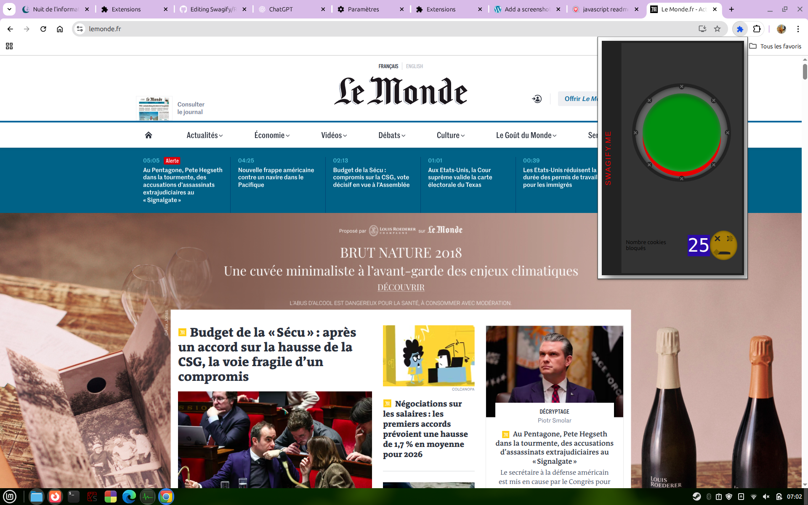

<!--A PROPOS  -->
## A Propos du projet :
Ce projet est réalisé dans le cadre de la Nuit de L'info ! Il concerne le défi <bold> NEVERHACK </bold>, qui nous engage à créer une extension Google Chrome
qui utilise le manifest V3.

### Construit avec :
Le projet a été construit avec du HTML5, du CSS3, et du JavaScript ! L'ensemble de ces langages nous permettent d'assurer une bonne compatibilité entre les différents modules.

### Préréquis :
- Il est reccomandé d'avoir Google Chrome, afin d'éviter tout problème de compatibilité.

### Installation

Ici, c'est un court tutoriel qui permet d'installer l'extension.
1. Lancer Google Chrome, et se diriger sur la page des extensions, activer le mode développeur
2. Installer l'extension, et la lancer.
3. Maintenant, tous est en ordre !
4. L'extension apparait maintenant et elle est active ! 😄

<!-- USAGE EXAMPLES -->
## Usage de l'extension
Cette extension peut être utilisée dans le cadre d'une navigation normale, tout en bloquant en arrière-plan un ensemble de traqueurs publicitaires utilisés pour récolter des informations personelles.

<!-- LICENSE -->
## Licence
Ce fichier est distribué sous une licence libre de droit, et plus exactement sous la licence GNU 3.0
<!-- CONTACT -->
## Contact
Nathan - Raphaël - Bastien - Ethan
Lien du Projet : https://github.com/Naitoo3/Swagify

### Captures d'écran de démonstration de notre extension
1. Une utilisation de notre extension sur le site de presse Le Monde :

